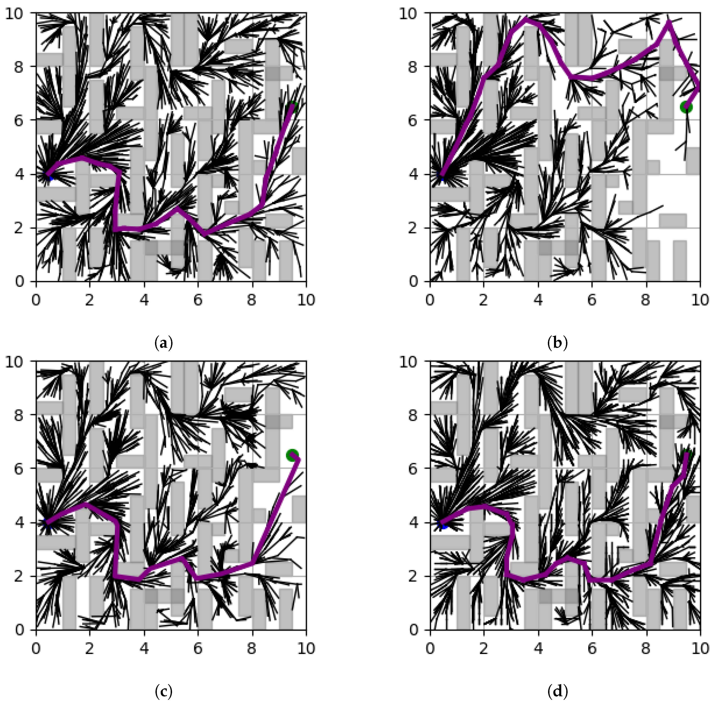

# TA-RRT*

TA-RRT* is a compact research implementation of RRT* with two adaptive ideas:

- corner- and visibility-guided sampling; and
- a smaller expansion step in geometrically dense regions.

The repository provides a reusable Python API, a deterministic command-line demo,
optional plotting, tests, and a minimal packaging configuration. The core planner
depends only on NumPy; Matplotlib is optional.

> [!WARNING]
> This is research software. It has not been certified for safety-critical,
> real-time, or autonomous operation. Always validate generated paths in the target
> system before execution.

## Associated paper

This repository implements the method described in:

> Taegeun Oh, Yun-Jae Won, and Sungjin Lee, “TA-RRT*: Adaptive Sampling-Based
> Path Planning Using Terrain Analysis,” *Applied Sciences*, vol. 15, no. 5,
> article 2287, 2025.

- DOI: [10.3390/app15052287](https://doi.org/10.3390/app15052287)
- Publisher page: [MDPI Applied Sciences](https://www.mdpi.com/2076-3417/15/5/2287)
- Published: 20 February 2025

## Result example from the paper



*Figure 10. Path-planning results in a complex environment: (a) RRT*,
(b) Informed-RRT*, (c) RRT*-Smart, and (d) TA-RRT*. Reproduced unchanged
from [Oh, Won, and Lee (2025)](https://doi.org/10.3390/app15052287),
licensed under [CC BY 4.0](https://creativecommons.org/licenses/by/4.0/).
See [assets/ATTRIBUTION.md](assets/ATTRIBUTION.md) for full attribution.*

If you use this repository in academic work, please cite the paper:

```bibtex
@article{oh2025ta_rrt,
  author         = {Oh, Taegeun and Won, Yun-Jae and Lee, Sungjin},
  title          = {{TA-RRT*}: Adaptive Sampling-Based Path Planning Using Terrain Analysis},
  journal        = {Applied Sciences},
  volume         = {15},
  number         = {5},
  article-number = {2287},
  year           = {2025},
  doi            = {10.3390/app15052287},
  url            = {https://doi.org/10.3390/app15052287}
}
```

Machine-readable citation metadata is available in [CITATION.cff](CITATION.cff),
and a standalone BibTeX record is available in [CITATION.bib](CITATION.bib).

> [!NOTE]
> This repository is a cleaned and refactored implementation. Its default demo is
> a smoke test, not an exact reproduction of every experiment in the paper. Exact
> numerical reproduction requires the original experiment maps, parameters, runtime
> environment, and trial protocol.

## Requirements

- Python 3.10 or newer
- NumPy 1.24 or newer
- Matplotlib 3.7 or newer only when plotting is requested

## Installation

Clone the repository and install it in editable mode:

```bash
git clone https://github.com/vailab-oh/vailab-repo.git
cd vailab-repo/UxV/Path-Planning/TA-RRT
python -m pip install -e .
```

To include plotting support:

```bash
python -m pip install -e ".[plot]"
```

For development tools:

```bash
python -m pip install -e ".[dev]"
```

## Quick start

Run the built-in deterministic demo without opening a plot:

```bash
python -m ta_rrt --seed 7 --iterations 1200
```

Show or save the resulting path:

```bash
python -m ta_rrt --plot
python -m ta_rrt --save-figure results/path.png
```

The legacy filename remains as a compatibility launcher:

```bash
python code_ta_rrt_241227.py --seed 7
```

The CLI does not write files unless `--save-figure` or `--output-csv` is supplied.
Use `python -m ta_rrt --help` for all options.

## Python API

```python
from ta_rrt import Node, ObstacleRectangle, PlannerConfig, plan

start = Node(1.0, 1.0)
goal = Node(9.0, 9.0)
obstacles = [
    ObstacleRectangle(3.0, 0.0, 1.0, 6.5),
    ObstacleRectangle(6.0, 3.5, 1.0, 6.5),
]

config = PlannerConfig(
    x_max=10.0,
    y_max=10.0,
    max_iterations=1500,
)
result = plan(start, goal, obstacles, config=config, seed=7)

if result.success:
    print(f"path length: {result.path_length:.3f}")
    for node in result.path:
        print(node.x, node.y)
else:
    print("No path found within the iteration limit")
```

`plan()` copies the supplied start and goal nodes, so repeated trials do not retain
parent or cost state from earlier runs. Supplying a seed makes the Python API and CLI
repeatable.

## Configuration

`PlannerConfig` controls the map size, iteration budget, goal radius, adaptive step
range, neighborhood radius, corner-density radius, uniform/adaptive sampling mix,
occupancy-grid resolution, and collision-check resolution.

The collision checker samples each segment at a configurable interval. Decrease
`collision_resolution` when obstacles or vehicle clearances are small. The planner
models a point robot; inflate obstacles before planning when the robot has nonzero
dimensions.

Both axis-aligned rectangular and circular obstacles are supported. Rectangular map
dimensions are supported as well.

## Development

Run the test suite with the Python standard library:

```bash
python -m unittest discover -s tests -v
```

If the development extras are installed, also run:

```bash
ruff check .
pytest
```

GitHub Actions runs the tests on supported Python versions for every push and pull
request.

## Repository layout

```text
ta_rrt/                 Reusable planner, plotting helper, and CLI
examples/basic_demo.py  Minimal library-use example
tests/                  Unit and deterministic smoke tests
code_ta_rrt_241227.py   Compatibility launcher for the former research filename
CITATION.cff            GitHub-compatible citation metadata
CITATION.bib            Standalone BibTeX citation
assets/                 Paper figure and its attribution record
```

Generated CSV files and visualizations should be written under `results/`; that
directory is ignored by Git to avoid committing repeated experiment output.

## Contact

For questions and inquiries, contact [tgoh@du.ac.kr](mailto:tgoh@du.ac.kr).

## Changes from the research prototype

- removed hidden dependence on module-level map, timing, and start-node variables;
- fixed the grid/map coordinate mismatch in corner-density calculations;
- checks the final segment before connecting a node to the goal;
- propagates cost changes to descendants after rewiring;
- supports circular obstacles and non-square maps consistently;
- avoids modifying caller-owned probability arrays;
- removed SciPy by using a small NumPy-based corner index;
- made random seeds, output paths, plotting, and iteration limits explicit; and
- separated generated results from source code.

## License

The source code is Copyright (c) 2026 Taegeun Oh and is distributed under the
MIT License. See [LICENSE](LICENSE).

The paper figure in `assets/` is not covered by the software license. It is
reproduced from the associated open-access article under CC BY 4.0; see
[assets/ATTRIBUTION.md](assets/ATTRIBUTION.md).
